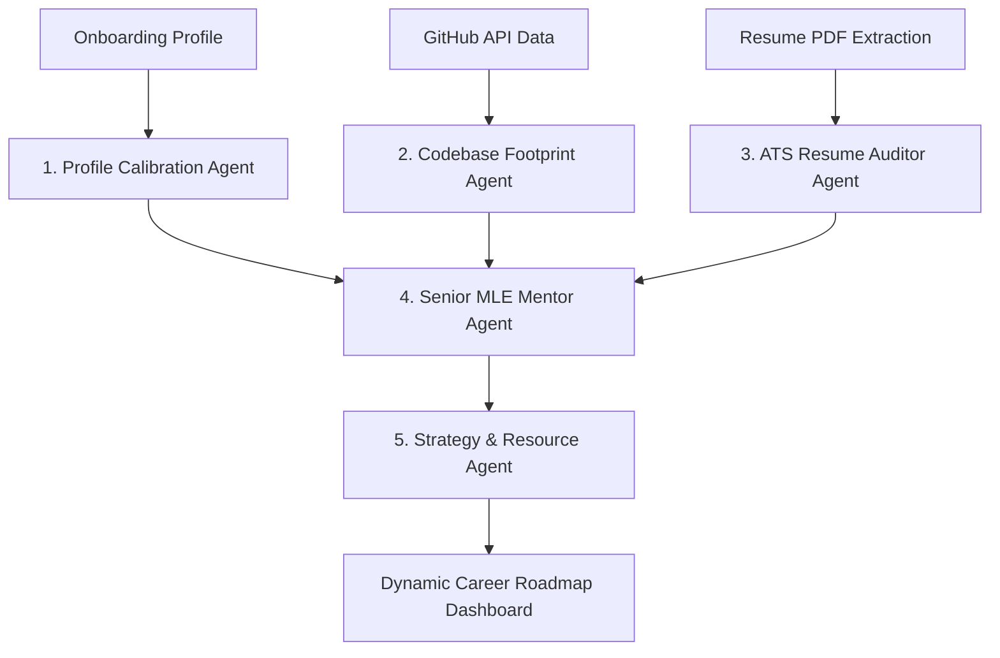
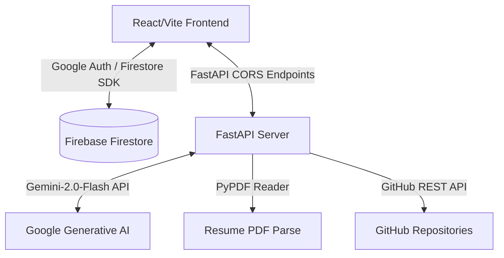

# Traject — AI Career Operating System (ML-Navigator)

[](https://traject-ml-navigator.vercel.app)
[](https://traject-api.onrender.com)
[](https://www.python.org/)
[](https://firebase.google.com/)
[](https://ai.google.dev/)

---

### 🏆 Kaggle x Google AI Agents Hackathon Project
Traject was engineered and submitted as a production-grade project for the **[Kaggle & Google 5-Day AI Agents Intensive Vibecoding Hackathon](https://www.kaggle.com/competitions/5-day-ai-agents-intensive-vibecoding-course-with-google)**. 

The intensive focused on building advanced, highly responsive, and robust agentic architectures utilizing the Google Gemini API. Traject elevates the "vibecoding" philosophy by delivering a high-fidelity interface backed by a structured FastAPI multi-agent backend.

---

## 🧭 The Core Vision & Goal
The core goal of Traject is to bridge the gap between **raw skills self-assessment** and **industry readiness** for Machine Learning Engineers. It elevates the candidate experience through:
- **Objective Calibration**: Comparing candidate ratings across core competencies (ML Knowledge, DSA, MLOps, System Design, SQL, Tools) directly against standard hiring benchmarks.
- **Evidence Verification**: Scanning active programming footprints (GitHub code density, commits, language patterns) to validate experience rather than relying on self-reporting alone.
- **Narrative Audits**: Automatically identifying keyword gaps and styling/formatting risks in PDF resumes using an ATS recruiter checklist.
- **Mentorship Alignment**: Providing structured engineering reviews and risk assessments from a virtual Senior ML Mentor.

---

## 🤖 Multi-Agent Collaboration Engine
Rather than relying on a single linear prompt or unified query, Traject uses a decentralized, collaborating network of AI agents. Each agent processes dedicated data domains and feeds its outputs into the next stage of the pipeline:



1. **Profile Calibration Agent**: Maps candidate self-ratings, academic backgrounds, and study schedules against standard industry benchmarks to determine baseline skill gaps.
2. **Codebase Footprint Agent**: Integrates with the GitHub API to scan repository structures, commits, language ratios, and code complexity signals, translating raw git metrics into verified evidence.
3. **ATS Resume Auditor Agent**: Extracts structured layout metadata and text sequences from PDF resumes to cross-reference against MLE job keywords and structure requirements.
4. **Senior MLE Mentor Agent**: Synthesizes inputs from the other agents to perform hiring risk calculations, identifying strong/weak engineering signals and narrative career feedback.
5. **Strategy & Resource Generator Agent**: Directs gap-closing learning and project roadmaps using `gemini-2.0-flash` structural output templates.

---

## ⚡ Key Features & Experience Phases

### 🔄 Phase 0: AI Boot Sequence
- **Interactive Execution Log**: Upon loading, the system runs a sequential, active compilation log showing collaborative agents analyzing profile data, retrieving career memory, and mapping benchmarks.
- **Transition WOW Moment**: Once complete, a `"Mission Ready"` status triggers a smooth visual transition, fading the console out and loading the dashboard.

### 🛡️ Phase 1: Mission Control Command Center
- **Mission Vector Tracking**: A high-visibility briefing displaying the candidate's current designation code, target MLE timeline, and the primary daily mission objective.
- **Dynamic Briefings**: Real-time study hours, progress multipliers, and estimated completion parameters.

### 📊 Phase 3: Career Readiness status
- **Decelerating Radial Gauge**: An interactive circular gauge displaying the readiness percentage, tier badge (e.g., "Internship Ready", "Junior MLE", "Senior MLE"), and recent score gains.
- **Sub-panel Connectors**: Layout links visual connections directly to adjacent diagnostic inputs.

### 🧠 Phase 4: Senior ML Engineering Mentor
- **Diagnostic Signal Cards**: Highlights strongest engineering signals, weakest skill areas, and current hiring risks.
- **Narrative Peer Review**: Generates a conversational engineering assessment detailing specific architectural changes required to land standard roles.

### 📈 Phase 5: Longitudinal Growth Timeline
- **Interactive Progress Charts**: Built with Recharts, drawing the historical progress curve sequentially and displaying detailed skill summaries on node hover.

### 💻 Phase 7: Repository Intelligence Workspace (GitHub)
- **Codebase Analyzer**: Connects to the GitHub API, parses public repositories, assesses language distribution, and calculates structural complexity scores.

### 📄 Phase 8: Resume Optimizer Experience
- **ATS Recruiter Checklist**: Supports drag-and-drop PDF upload. Reads formatting structures using PyPDF, checks keyword densities, and highlights specific gaps/action checklists.

---

## 🛠️ Architecture & Tech Stack



### Frontend
- **Framework**: React 19 + Vite 8
- **Styling**: Vanilla CSS, Tailwind CSS, PostCSS (Glassmorphism layout, radial highlights, and custom cyber-grid background system)
- **Charts & Interaction**: Recharts, Lucide Icons, Framer-inspired micro-animations
- **Database Connection**: Firebase Auth (with Google Provider) & Firestore SDK

### Backend
- **Framework**: FastAPI (Python 3.11)
- **Parser Engine**: PyPDF (PDF text-extraction and keyword mapping)
- **Intelligence Layer**: Google Generative AI (`gemini-2.0-flash`)
- **Credentials/Security Validation**: Firebase Admin SDK

---

## ⚙️ Environment Configurations

### Frontend Configuration (`frontend/.env`)
Create a `.env` file in the `frontend` folder with the following variables:
```env
VITE_FIREBASE_API_KEY=your_firebase_api_key
VITE_FIREBASE_AUTH_DOMAIN=your_project_id.firebaseapp.com
VITE_FIREBASE_PROJECT_ID=your_project_id
VITE_FIREBASE_STORAGE_BUCKET=your_project_id.firebasestorage.app
VITE_FIREBASE_MESSAGING_SENDER_ID=your_messaging_sender_id
VITE_FIREBASE_APP_ID=your_firebase_app_id
VITE_API_URL=http://localhost:8000
```

### Backend Configuration (`backend/.env`)
Create a `.env` file in the `backend` folder with the following:
```env
GEMINI_API_KEY=your_gemini_api_key
GITHUB_TOKEN=your_personal_access_token_optional
```
*Note: Make sure to place your Firebase admin key `serviceAccountKey.json` inside the `backend/` folder.*

---

## 🚀 Getting Started

### Prerequisites
- Node.js (v18+)
- Python 3.11

### 1. Backend Setup
1. Navigate to the `backend` directory:
   ```bash
   cd backend
   ```
2. Create and activate a Python virtual environment:
   ```bash
   python -m venv venv
   # On Windows:
   .\venv\Scripts\activate
   # On macOS/Linux:
   source venv/bin/activate
   ```
3. Install dependencies:
   ```bash
   pip install -r requirements.txt
   ```
4. Start the FastAPI development server:
   ```bash
   uvicorn main:app --reload --port 8000
   ```

### 2. Frontend Setup
1. Open a new terminal and navigate to the `frontend` directory:
   ```bash
   cd frontend
   ```
2. Install dependencies:
   ```bash
   npm install
   ```
3. Run the Vite development server:
   ```bash
   npm run dev
   ```
4. Open your browser and navigate to `http://localhost:5173/`.

---

## 🌐 Production Deployments
- **Frontend**: Deployed on **Vercel** (`https://traject-ml-navigator.vercel.app`)
  - Includes a `vercel.json` rewrites configuration to handle client-side routing and prevent `404` errors on refresh.
- **Backend**: Deployed on **Render** (`https://traject-api.onrender.com`)
  - Configured with `PYTHON_VERSION=3.11.9` to bypass dependency conflicts in `python-multipart` and older `grpcio` packages.
  - Whitelisted production domain in CORS middleware to prevent preflight blocks.
